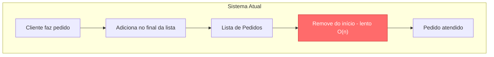
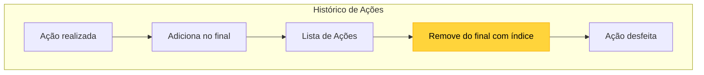

# Desafio de Codificação: Dominando Filas e Pilhas

## Descrição do Desafio

Neste desafio, você irá trabalhar com duas das estruturas de dados mais fundamentais da programação: Filas (Queue) e Pilhas (Stack). O objetivo é identificar cenários onde o uso incorreto de listas/arrays prejudica a clareza e eficiência do código, substituindo-os pelas estruturas de dados apropriadas.

- **Fila (Queue)**: Segue o princípio FIFO (First In, First Out) - o primeiro elemento a entrar é o primeiro a sair.
- **Pilha (Stack)**: Segue o princípio LIFO (Last In, First Out) - o último elemento a entrar é o primeiro a sair.

## Situação-Problema Real

Você foi contratado para revisar o código de um sistema de atendimento ao cliente de uma lanchonete. O sistema possui duas funcionalidades principais:

1. **Fila de Pedidos**: Os clientes fazem pedidos que devem ser atendidos na ordem de chegada (quem pediu primeiro, recebe primeiro).
2. **Histórico de Ações**: O atendente pode desfazer a última ação realizada (como cancelar o último pedido adicionado por engano).

O desenvolvedor anterior utilizou arrays/listas simples para ambas as funcionalidades, manipulando índices manualmente. Isso resultou em código confuso, propenso a erros e com baixo desempenho em algumas operações.

##  Regras do Desafio
- O desafio está aberto para todas as linguagens de programação.
- Você deve:
  - Identificar qual estrutura de dados (Fila ou Pilha) é apropriada para cada funcionalidade.
  - Refatorar o código utilizando as estruturas de dados corretas.
  - Demonstrar a diferença de clareza entre o código original e o refatorado.
- O código deve ser limpo, bem organizado e de fácil leitura.
- Bônus: adicione testes automatizados para validar o comportamento.

## Exemplo de Código Ruim (AS IS)

O código abaixo representa a implementação atual do sistema, utilizando arrays de forma inadequada.

```csharp
using System.Collections.Generic;

public class SistemaAtendimento
{
    private List pedidos = new List();
    private List<(string, string)> historicoAcoes = new List<(string, string)>();

    // Fila de pedidos - usando List de forma ineficiente
    public void AdicionarPedido(string pedido)
    {
        pedidos.Add(pedido);
        historicoAcoes.Add(("adicionar", pedido));
    }

    public string AtenderProximo()
    {
        if (pedidos.Count > 0)
        {
            // Remove o primeiro elemento - O(n) em List
            string pedido = pedidos[0];
            pedidos.RemoveAt(0);
            return pedido;
        }
        return null;
    }

    // Desfazer acao - logica confusa com indices
    public (string, string)? DesfazerUltimaAcao()
    {
        if (historicoAcoes.Count > 0)
        {
            var ultima = historicoAcoes[historicoAcoes.Count - 1];
            historicoAcoes.RemoveAt(historicoAcoes.Count - 1);
            return ultima;
        }
        return null;
    }
}
```

## Problemas Identificados
1. **Fila de Pedidos**: Remover o primeiro elemento de uma lista/array tem complexidade O(n), pois todos os elementos precisam ser deslocados.
2. **Histórico de Ações**: O código usa índices manuais (length - 1) em vez de métodos semânticos, tornando a intenção menos clara.
3. **Legibilidade**: O código não expressa claramente que uma funcionalidade é uma fila e outra é uma pilha.





## Objetivo
Refatore o código acima utilizando:

- **Queue/Fila** para gerenciar os pedidos (garantindo FIFO com operações O(1)).
- **Stack/Pilha** para gerenciar o histórico de ações (garantindo LIFO com métodos semânticos como push e pop).

O código refatorado deve ser mais expressivo, eficiente e fácil de manter.